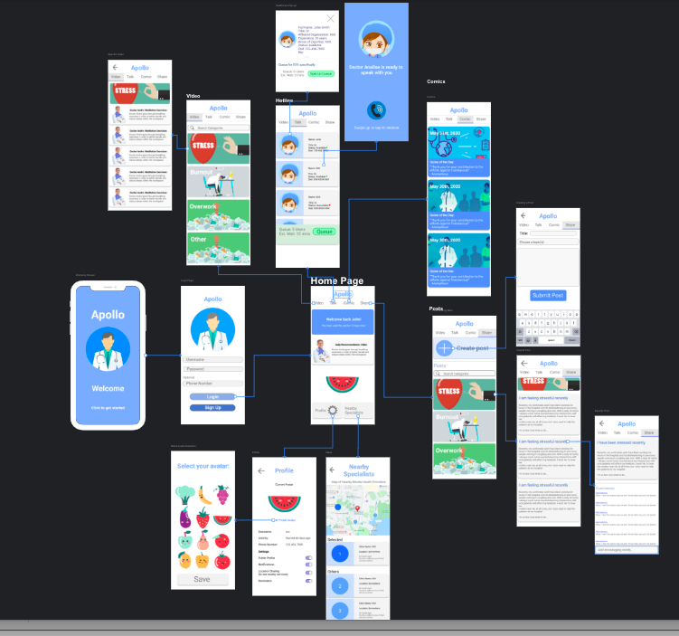
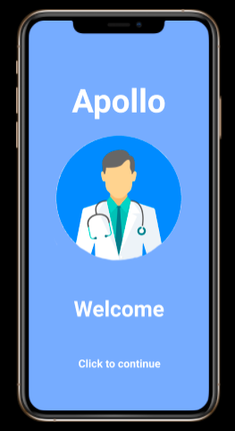
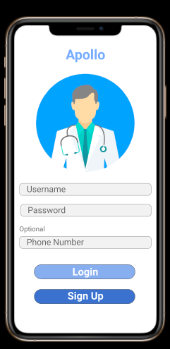
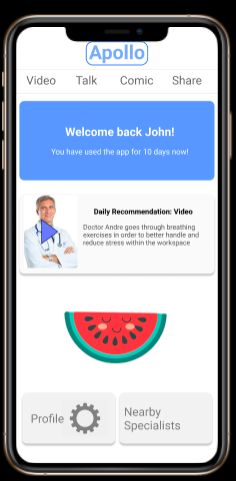

# INFO 200 Final Project 

## Summary

This is a cumulative group project for the class INFO 200 (Intellectual Foundations of Informatics) at the University of Washington. My group and I decided to focus on creating and designing a solution to help investigate and address the lack of mental health awareness among healthcare workers. Since hospitals are primarily a place meant for taking care of patients, focus is lost towards handling and recognizing the stress and workload of healthcare workers. The unawareness from both healthcare professionals and ourselves leads to many doctors and nurses to drown in mental health problems without notice, and it can impact their lives and work. Situations like COVID-19 only emphasize the stakes in taking care of healthcare professionals’ mental health. Burn out of many of our doctors and nurses means fewer people on the field to help others. Thus, my group and I decided to design an app for our solution to address this issue. 

## INFO 200 Project Final Prototype.pdf

This pdf file contains writing that describes our solution in much greater detail including primary/secondary features, usage scenarios, design language/decisions, and what other solutions my group and I considered. 

## Figma Links

For this project, my group and I utilized Figma to design our wireframe and prototype. 

Wireframe: https://www.figma.com/file/sdwfzsFtP2nRhZLUTxuPMg/INFO-200-Apollo-Wireframe?node-id=9%3A382

Interactive Prototype: https://www.figma.com/proto/sdwfzsFtP2nRhZLUTxuPMg/INFO-200-Apollo-Wireframe?node-id=238%3A405&scaling=min-zoom

## Sample Images

Wireframe: 

  

Welcome screen:

  

Login screen:

  

Home screen:

  

